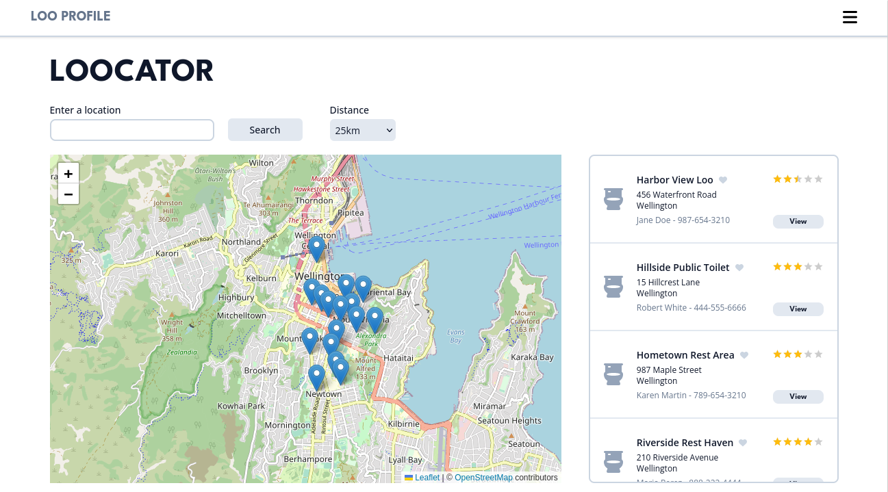
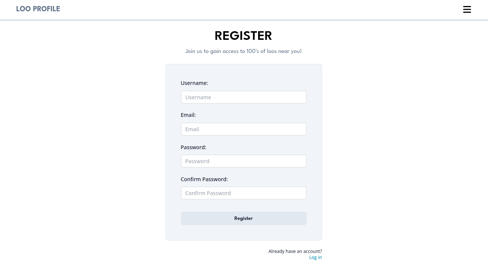

# LOO PROFILE

### When you're probably just a bit too passionate about public loos

Loo Profile is a public toilet locator that removes restroom roulette from your trip.

### Learning Outcomes

My learning outcomes for this project were to create a fullstack application that consolidates my learning into a fun, 
useful and challenging project. For this project, I wanted to implement auth through a third-party service, and improve 
test coverage, user experience and use location services.

### Tools used

- Figma - <a href="https://www.figma.com/file/Knbj5kkdzLhfCVzG02689M/Untitled?type=design&node-id=0%3A1&mode=design&t=gqnNXYZ86qG9OWVm-1">SOURCE</a>
- <a href="https://tailwindcss.com/">Tailwind CSS</a>
- <a href="https://fontawesome.com/">FontAwesome Icons</a>
- <a href="https://www.npmjs.com/package/react-simple-star-rating">Simple Star Rating</a>
- React / <a href="https://vitejs.dev/">Vite</a>
- <a href="https://www.npmjs.com/package/react-router">React Router</a>
- <a href="https://tanstack.com/">TanStack Query</a>
- <a href="https://www.npmjs.com/package/superagent">SuperAgent</a>
- <a href="https://leafletjs.com/">Leaflet</a> & <a href="https://www.openstreetmap.org/">OpenStreetMaps</a>
- NodeJS / <a href="https://www.npmjs.com/package/express">Express</a>
- <a href="https://knexjs.org/">KNEX / SQLITE / PostgreSQL</a> 
- <a href="https://firebase.google.com/">FireBase Auth / Admin</a>
- <a href="https://www.npmjs.com/package/cors">cors</a>
- <a href="https://www.npmjs.com/package/geolib">GeoLib</a>
- <a href="https://testing-library.com/">Testing Library</a>
- <a href="https://www.npmjs.com/package/supertest">SuperTest</a>

### What's Next?

- Improve Tailwind
- User utilities
- Saving Loos
- Better tests and test coverage
- Click to select address
- Improved User Profiles
- Refactoring!
  
### More Screenshots

